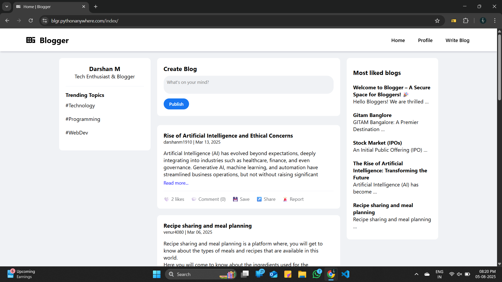
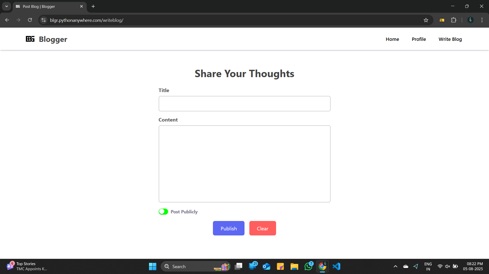
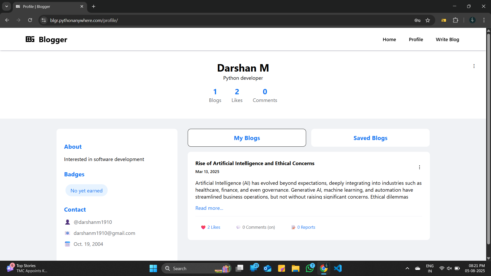

# 📰 Blogger – A Secure Space for Bloggers

Live Site: [https://blgr.pythonanywhere.com](https://blgr.pythonanywhere.com)

Blogger is a modern, full-featured blogging platform that allows users to write, manage, and interact with blogs in a clean, social environment. Built with Django and REST APIs, it offers personalized profiles, privacy control, blog settings, and auto-moderation features.

---

## ✨ Key Features

### 🧾 Blog Writing & Publishing
- Compose and format blogs with a **public/anonymous** toggle
- Edit or delete your own blogs anytime
- "Clear" draft functionality

### 👤 Profile Section
- View blog count, likes, comments
- "My Blogs" & "Saved Blogs" tabs
- Add an About section and personal info
- Set profile visibility (public/private)

### 🏠 Home Feed
- Read blogs from all users
- Access "Most Liked Blogs" sidebar
- Interact with blogs via:
  - 👍 Like
  - 💬 Comment (toggleable)
  - 📌 Save
  - 🔁 Share
  - 🚩 Report

### 🧠 Auto Moderation
- Blogs reported by 10+ users are auto-deleted
- Commenting can be disabled per blog by the author

---

## 🧑‍💻 Built With

- **Backend**: Django + Django REST Framework  
- **Frontend**: HTML, CSS, JS  
- **Database**: MySQL  
- **Deployment**: [PythonAnywhere](https://www.pythonanywhere.com/)

---

## 📸 Screenshots

### 🏠 Home Page  

### ✍️ Write Blog  

### 👤 Profile Page  

*(Add these screenshots to a `/screenshots` folder in your repo)*

---

## 📌 Highlights

- 🔐 OTP & Password based authentication
- 🧑 Anonymous posting supported
- 📈 Trending blogs section
- 🚀 User-friendly UI and clean layout
- 📋 Moderation through community reporting

---

## 🙋‍♂️ Author

**Darshan M**  
📧 [darshanm1910@gmail.com](mailto:darshanm1910@gmail.com)  
🐙 [GitHub Profile](https://github.com/yourusername)

---
